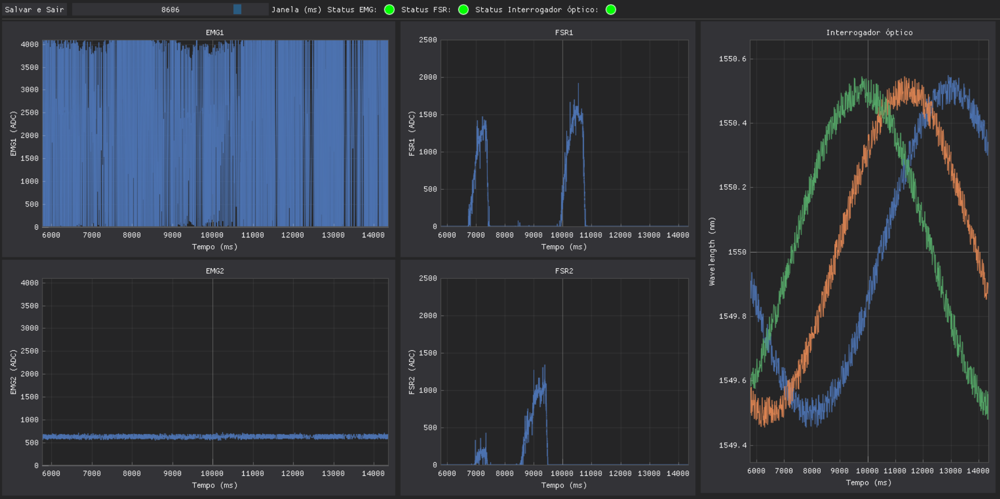

# Biotrino

This project acquires sEMG (2 channels) and FSR signals in real time, displaying the graphs in a modern graphical interface using [Dear PyGui](https://github.com/hoffstadt/DearPyGui).

---

## 🖥️ Features

- Serial reading of EMG and FSR signals (via proprietary board).
- Interface divided into three sections:
  - EMG (2 channels)
  - FSR (2 channels)
  - Terminal for logs
- Controls for:
  - Adjusting the display window (slider).
  - Connecting and disconnecting the acquisition board safely.
  - Starting and stopping an incrementally saved `.csv` recording.
  - Monitoring the actual sample rate, invalid packets and lost samples.
  - Pausing or autoscaling plots without interrupting acquisition.
  - Identifying each participant or experimental session.

---

## 📷 Interface



---

## 📦 Requirements

- Python 3.8 or higher

---

## 🚀 Step-by-step guide to running the project

### 1. Clone the repository (if you haven't already)

```bash
git clone <repository-url>
cd <folder-name>
```

### 2. Create a virtual environment (recommended)

- On Windows (PowerShell):

```bash
python -m venv venv
.\venv\Scripts\Activate.ps1
```

- On Windows (Command Prompt):

```bash
python -m venv venv
venv\Scripts\activate.bat
```

- On Linux/MacOS:
```bash
python3 -m venv venv
source venv/bin/activate
```

### 3. Install dependencies
```bash
pip install -r requirements.txt
```

### 4. Execute
```bash
python main.py
```

### 5. Acquisition workflow

1. Upload `FSR_EMG/src/main.cpp` to the ESP32.
2. Select the board serial port and keep the baud rate at `921600`.
3. Click **Conectar** and wait for **Recebendo dados**.
4. Optionally enter a participant/session identifier.
5. Click **Iniciar coleta**. Data is written continuously to `out_data`.
6. Click **Parar e salvar** before disconnecting the board.

The current firmware sends six columns: sample number, ESP32 timestamp in
microseconds, EMG1, EMG2, FSR1 and FSR2. The sample number lets the interface
report missed acquisition cycles. Four-column legacy firmware remains readable,
but it cannot provide device timestamps or loss detection.

CSV files start with metadata lines prefixed by `#`. When loading them with
pandas, use `pandas.read_csv(path, comment="#")`.
